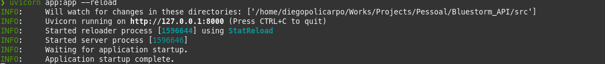
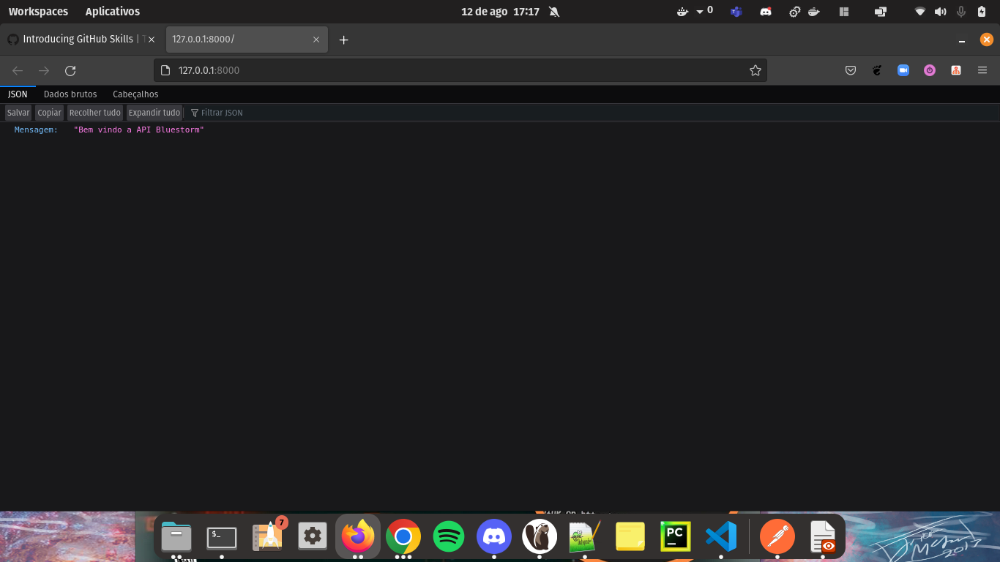
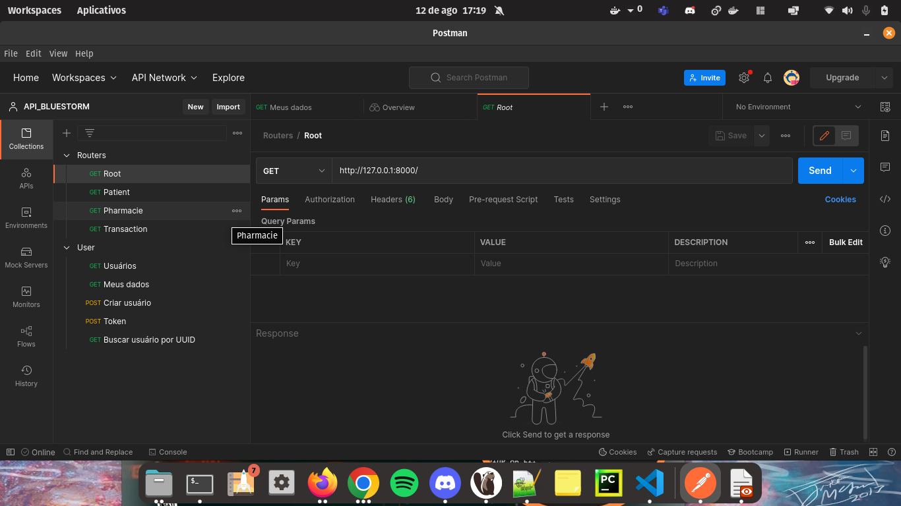
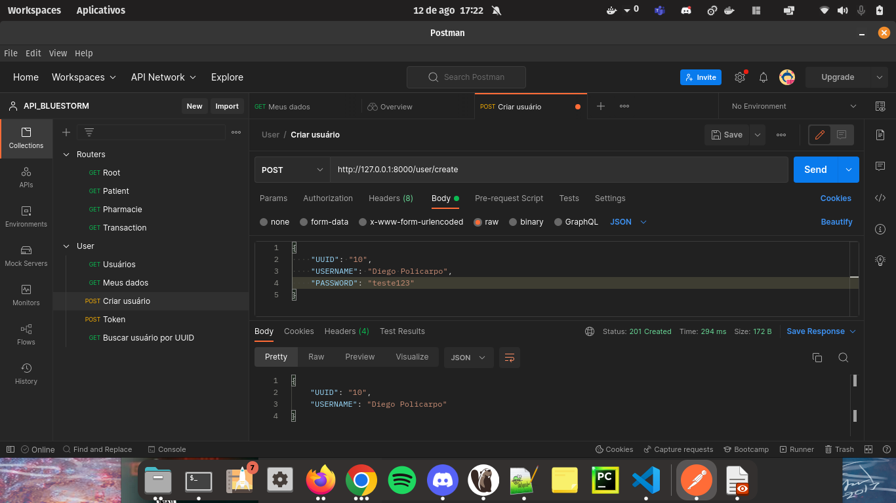
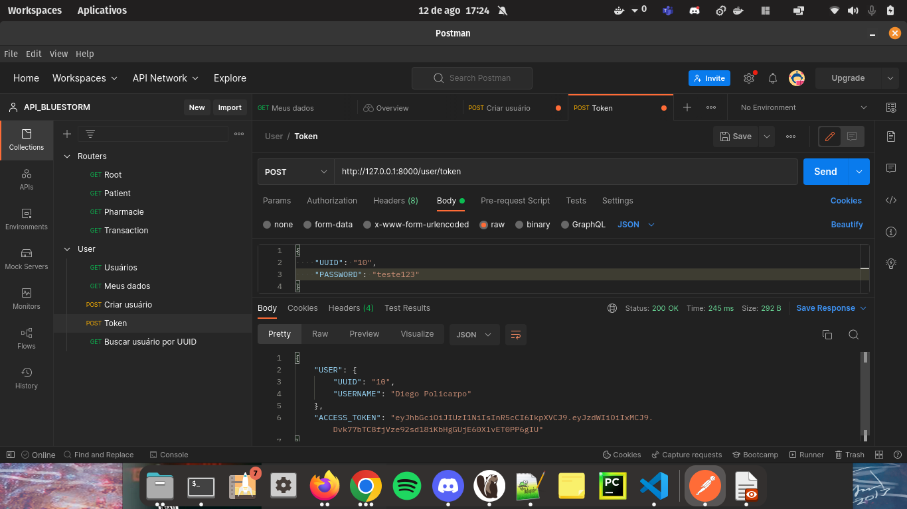
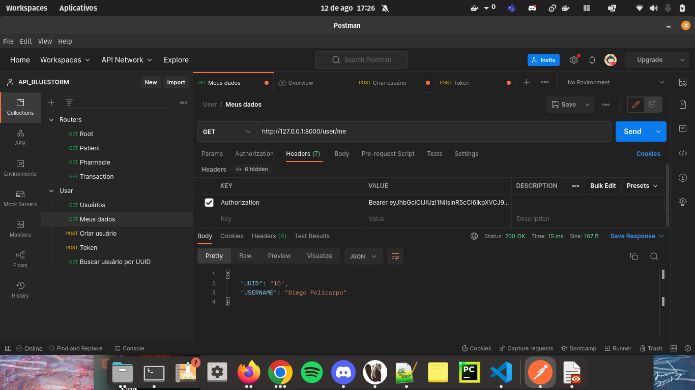
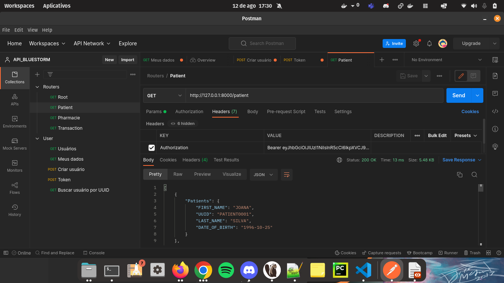

# API Bluestorm

Projeto desenvolvido para teste prático

## 🚀 Começando

Essas instruções permitirão que você obtenha uma cópia do projeto em operação na sua máquina local para fins de desenvolvimento e teste.

Consulte **Implantação** para saber como implantar o projeto.

### 📋 Pré-requisitos

De que coisas você precisa para rodar o programa?

```
Python v3.7
```
```
Visual Studio Code (opcional)
```


### ⚙️ Implantação

Segue abaixo uma série de exemplos passo-a-passo que informam para ter um ambiente de desenvolvimento em execução.
- Lembrando que esse projeto foi desenvolvido no Linux, poretanto, os comandos abaixo são relacioanados ao sistema operacional informado
#
### Conteudo

API Rest desenvolvida para consumo de 3 Rotas:
- Patients
- Pharmacies
- Transactions

Todas as rotas solicitam autenticação para ser consumidas, sendo a partir da criação de um usuário, gerando um token e o mesmo sendo validado, para assim ter o acesso aos endpoits.
#

1. Crie uma venv pelo terminal:
```
virtualenv venv
```
2. Ative a venv:
```
source venv/bin/activate
```
3. Instale o requirements.txt:
```
pip install -r requirements.txt
```
4. No terminal, acesse a pasta /src e execute o comando do uvicorn para iniciar a API:
```
uvicorn app:app --reload
```


5. Abra o endereço em um navegador e verifique se apresentou a tela inicial:



6. Importe as Collections para o Postman e teste as rotas criadas:



7. As rotas existentes funcionam apenas com autenticação, conforme o passo a passo abaixo:
- Crie um usuário



8. Gere o token para esse usuário:



9. Valide o token informando no campo "Value", sendo Bearer + token. A resposta será o usuário que gerou o token.



10. Para qualquer endpoint, é necessário a informação do token para acesso passando no Headers, conforme imagem.




## 🛠️ Biblioecas utilizadas

- SQLAlchemy
- FASTAPI
- Passlib
- Python Jose

## ✒️ Autores

* **Desenvolvedor** - [Diego Policarpo](https://github.com/PolicarpoDi)


